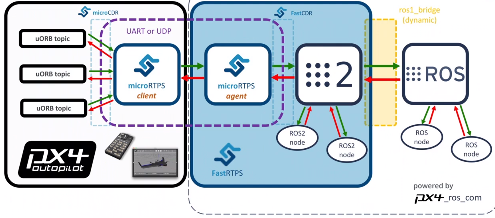

# ROS2$\cross$PX4

## Basic Concepts

1. Data Distribution Service (DDS)

   1. a middle ware protocol & API standard
   2. developed by Object Management Group (OMG)
   3. to provide data-centric connectivity

2.  DDS Specification & DDS Interoperability Wire Protocol (DDSI-RTPS)

   1. they are documents that describe standards to follow
   2. DDS Specification describes standards for a sub-pub model
   3. DDSI-RTPS describes a way to implement DDS on unreliable comm, which is the Real Time Publish Subscribe Protocol (RTPS)

3. FAST RTPS/DDS

   1. developed by eprosima, open source, high performance
   2. C++ implementation of RTPS protocol
   3. the default middle ware of ROS2

4. ROS2

   1. a general purpose **robotics library**
   2. captures most of the learnings and recently added features of [ROS (1)](https://docs.px4.io/master/en/ros/ros1.html), improving a number of flaws of the earlier version
   3. some useful packages in this set up
      1. `px4_msgs` contains PX4 ROS message definitions. When this project is built it generates the corresponding ROS 2-compatible typesupport, used by ROS 2 nodes, and IDL files, used by `fastddsgen` to generate the microRTPS agent code.
      2. `px4_ros_com` contains the microRTPS agent code templates for the agent publishers and subscribers. The build process runs a `fastddsgen` instance to generate the code for the `micrortps_agent`, which compiles into a single executable.

5. PX4-ROS2 bridge

   1. the software (translation layer) between ROS 2 and PX4
   2. provides a bridge between PX4 UORB messages and ROS 2 messages and types, effectively allowing direct access to PX4 from ROS 2 workflows and nodes

6. microRTPS bridge

   1. PX4 middleware that underlies the PX4-ROS 2 bridge
   2. also provided by eprosima
   3. consists of a client running on PX4 and an agent running on the Mission/Companion Computer

7. microCDR and fastCDR

   1. provided by eprosima
   2. *C* library implementing the CDR (standard serialization methods)

8. ros1 bridge

   1. official ROS 1 Bridge package that allows ROS 1 and ROS 2 applications to be used in a single setup.

9. Overview

   

## Setup on 20.04 and foxy

1. install ros2: https://docs.ros.org/en/foxy/Installation/Ubuntu-Install-Debians.html
   1. addition tools https://docs.px4.io/master/en/ros/ros2_comm.html
   
2. use sdkman to install the correct version of gradle

3. install fastrtpsgen from source: https://docs.px4.io/master/en/dev_setup/fast-dds-installation.html

4. rerun the px4 setup script

5. **important notice about PX4 and ros2 package versions**

   1. PX4 should be on master branch instead on stable release branches
      * master branch should have every commit history
      * to avoid frequent changes, one possible way is to fix derive a development branch from the commit that is consistent to the latest stable release
   2. px4_msgs is a repo for storing the same set of uorb msgs, should include custom msgs
      * use uorb_to_ros_msgs.py to sync with uorb
   3. px4_ros_com is for com, it depends on px4_msgs and `template/urtps_bridge_topics.yaml`
      * use uorb_to_ros_urtps_topics.py to sync with uorb

   > urtps_bridge_topics.yaml marks what msg to be communicated. if updated, run the ./generate_template_and_rebuild_ROS2.sh

## ROS2 basics

1. WS setup
   1. clone into src
   2. install dependencies at ws root `rosdep install -i --from-path src --rosdistro foxy -y`
   3. `colcon build`
      1. `--packages-up-to` builds the package you want, plus all its dependencies, but not the whole workspace (saves time)
      2. `--symlink-install` saves you from having to rebuild every time you tweak python scripts
      3. `--event-handlers console_direct+` shows console output while building (can otherwise be found in the `log` directory)
      4. `colcon build --packages-select my_package` to save time even other pkgs are already built
   4. source `install/setup.bash`
   5. ament and colcon
      1. ament is the build system
      2. colcon is the build tool
2. package
   1. consist of
      1. cmakelist
      2. package.xml
   2. creation: in src folder `ros2 pkg create --build-type ament_cmake --node-name ${NODE_NAME} ${PACKAGE_NAME}`
   3. run: `ros2 run ${PACKAGE_NAME} ${NODE_NAME}`
   4. dependencies
      1. package.xml `<depend>`
      2. cmakelist 
         1. `find_package ament_target_dependencies`
         2. `ament_target_dependencies`
   5. executable and install in cmakelist so that ros2 run can find it

