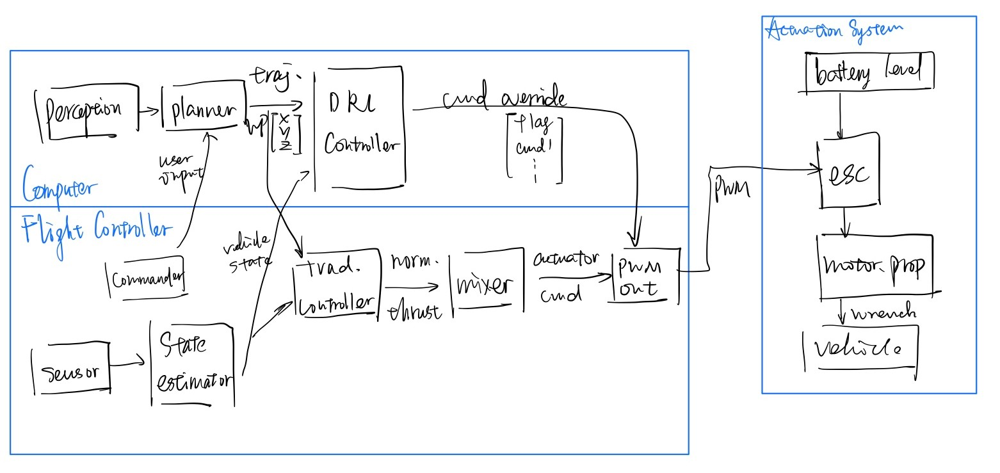

# Deep Reinforcement Learning Autopilot



## branch information

1. ROOT
   1. master (ROS2, **always switch px4 back to ROS2 branch before commiting**)
   3. other dev branches (dynamically created and merged)
2. PX4
   1. master: upstream
   2. DRL-Autopilot: ros1 based DRL method
   3. DRL2-Autopilot: ros2 based, derived from master at the time of clone
   4. modified repos should be merged with future stable releases
3. mavlink C library in PX4
   1. master: upstream
   2. DRL-Autopilot: to cooperate with ros1 mavros system
4. sitl_gazebo
   1. master: upstream
   2. DRL-Autopilot: for DRL training, ros1 and ros2 use the same branch
5. mavros and mavlink (ROS1)
   1. master: upstream
   2. DRL-Autopilot: ros1 packages for px4 DRL-Autopilot branch

## usage

1. with ROS1
   1. clone this repo recursively, **checkout the correct branches**
   2. build ros packages with `catkin build`, remember to source this workspace and launch mavros by `roslaunch mavros px4.launch fcu_url:="udp://:14540@127.0.0.1:14557"`
   3. launch QGC and build PX4 by `make px4_sitl gazebo`
2. with ROS2
   1. clone the repo recursively, **checkout the correct branches DRL2-Autopilot**
   2. build ros packages with the script `buid_ros2_px4_clean.sh`
   3. launch QGC and build PX4 by `make px4_sitl_rtps gazebo`
   4. `micrortps_agent -t UDP` to start daemon process (built within the px4_ros_com package)
   5. `ros2 launch px4_ros_com sensor_combined_listener.launch.py` (demo) or use rqt to access topics
   6. create other ros2 applications and use the topic

## REPO structure

1. `dev_notes`
   * about recent development progress and interesting paper related to this project
2. `ros*_workspace`
   * ros workspaces as they are
3. `*.sh`
   * useful lazy buttons
4. `PX4-Autopilot`
   * sensor, RC, PWM driver interface

## TODOs

0. plugins
   * motor model (done) -> gazebo_ros_motor_model 
      * [wind interference] `Philppe Martin, Erwan Salaün, The True Role of Accelerometer Feedback in Quadrotor Control, 2010 IEEE Conference on Robotics and Automation paper`
      * [rolling moment] $- \omega * \mu_1 * V_A^{\perp}$
   * precise joint vel control (done) -> gazebo_ros_joint_motor
   * topic cannot be ending with `/[number only]` 
1. learn to use ros2-python interface
   * good to go
2. check motor speed consistency with PWM pipeline

   ```
   double real_motor_velocity = motor_rot_vel_ * rotor_velocity_slowdown_sim_;

   double force = real_motor_velocity * std::abs(real_motor_velocity) * motor_constant_;

   ignition::math::Vector3d relative_wind_velocity = body_velocity - wind_vel_;

   ignition::math::Vector3d velocity_parallel_to_rotor_axis = (relative_wind_velocity.Dot(joint_axis)) * joint_axis;

   double vel = velocity_parallel_to_rotor_axis.Length();

   double scalar = 1 - vel / 25.0;

   ignition::math::Vector3d velocity_perpendicular_to_rotor_axis = relative_wind_velocity - (relative_wind_velocity.Dot(joint_axis)) * joint_axis;

   ignition::math::Vector3d air_drag = -std::abs(real_motor_velocity) * rotor_drag_coefficient_ * velocity_perpendicular_to_rotor_axis;

   ignition::math::Vector3d drag_torque(0, 0, -turning_direction_ * force * moment_constant_);

   rolling_moment = -std::abs(real_motor_velocity) * rolling_moment_coefficient_ * velocity_perpendicular_to_rotor_axis;

   link_->AddRelativeForce(ignition::math::Vector3d(0, 0, force * scalar));

   link_->AddForce(air_drag);

   parent_links.at(0)->AddRelativeTorque(drag_torque_parent_frame);

   parent_links.at(0)->AddTorque(rolling_moment);

   if (armed) {
      input_reference_[i] = (actuator_controls[input_index_[i]] + input_offset_[i]) * input_scaling_[i] + zero_position_armed_[i];
   } 
   else {
      input_reference_[i] = zero_position_disarmed_[i];
   }

   ```

   * in `px4.mixer_module.cpp` mixing `outputs` [-1, 1], linear map to pwm `_current_output_value` [min, max], default is [1000, 2000]
   * in `sitl.mavlink_interface` actuator_controls [0, 1]
   * conclusion on iris default sitl:
      * MIX_OUT=[-1, 1], PWM=[1000, 2000], ACTUATOR_CTRL=[0, 1], VEL_REF=[0, 1], VEL_REF={0, [100, 1100]}, REAL_VEL_REF=VEL_REF/10
      * VEL_REF = (PWM - 900)/10
      * use ros topic to set VEL_REF directly
3. formulate the problem and construct gym env
4. export the network to CPP
5. write a trajectory generator from stick input
